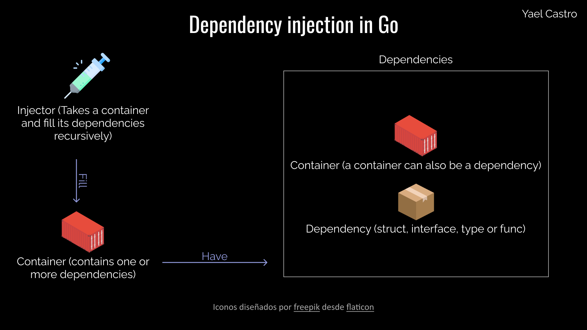

# Go Dependency Injection (No libraries)
[](https://github.com/yael-castro)

[](https://goreportcard.com/report/github.com/yael-castro/godi)

Project template based on the most common layered architecture style, made to explain how to do dependency injection in golang without using any library

**Important**
The purpose of this project is to show a way to do dependency injection in golang and not how to structure your project.

It should take more importance to how the dependencies are communicated than to the structure of the project

**Notes**
No library is used in this project
<hr>

###### Architecture style explained
Although the main idea is not to show how to structure your application in go (since that depends on many factors), it is necessary to explain the architecture to navigate the project and understand the main idea (how to make a dependency injection in go) more easily.

The architectura style is the most common layered architecture pattern.

This have three layers:

1. The presentation layer:      In this layer founds the web ui, cli or the rest api
2. The business logic layer:    In this layer founds the business logic
3. The data access layer:       It is the persistence layer

```
internal
├── business    (business layer)
├── dependency  (manage dependencies)
├── handler     (presentation layer)
├── model       (objects)
└── repository  (persistence layer)
```

###### Dependency injection explained


<a href="https://www.flaticon.com/free-icons/box" title="box icons">Box icons created by Good Ware - Flaticon</a>

<a href="https://www.flaticon.com/free-icons/injection" title="injection icons">Injection icons created by Freepik - Flaticon</a>

<a href="https://www.flaticon.com/free-icons/container" title="container icons">Container icons created by vectorsmarket15 - Flaticon</a>